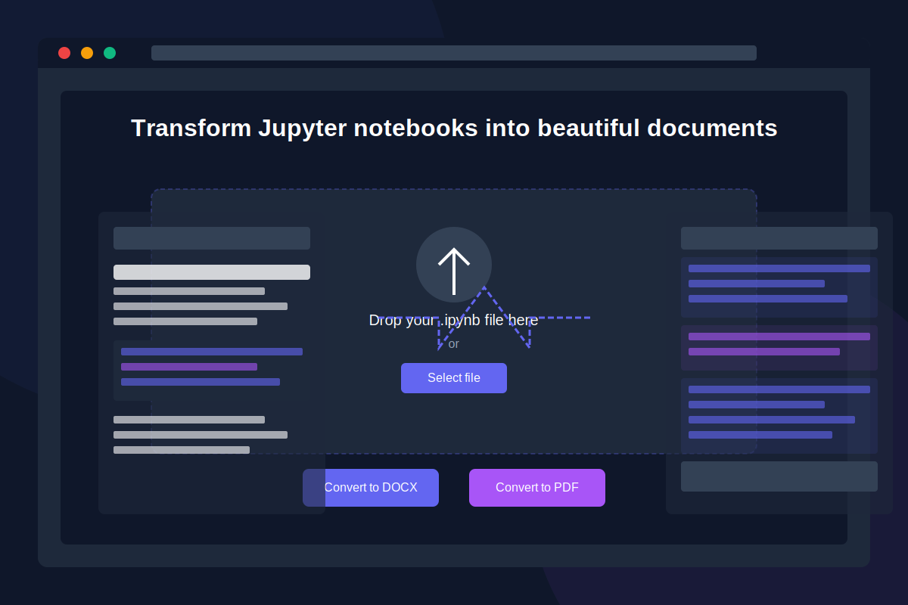

# 🚀 AutoLabDocs

<div align="center">
  
  <h3>Transform Jupyter notebooks into beautiful documents in seconds</h3>
  <p>Stop taking manual screenshots. Start creating professional lab reports.</p>
  
  [](https://nextjs.org/)
  [](https://www.typescriptlang.org/)
  [](https://tailwindcss.com/)
  [](LICENSE)
</div>

## 📖 The Problem

> "I was tired of spending hours taking screenshots of my Jupyter notebooks for lab reports. There had to be a better way."

As a student/researcher, I spent countless hours manually capturing screenshots from Jupyter notebooks to include in lab reports and documentation. This tedious, time-consuming process interrupted my workflow and reduced productivity.

**AutoLabDocs** was born from laziness and frustration – the two greatest motivators for innovation.

## ✨ Solution

AutoLabDocs automates the conversion of Jupyter notebooks (.ipynb files) to beautifully formatted DOCX and PDF documents with a single click. No more screenshots, no more manual formatting, no more wasted time.

## 🎯 Key Features

- **🔄 One-Click Conversion** - Transform notebooks into professional documents instantly
- **⏱️ Save Hours of Work** - No more manual screenshots or tedious formatting
- **💻 Beautiful Code Formatting** - Automatic syntax highlighting and proper indentation
- **📄 Multiple Export Formats** - Export to DOCX, PDF, or both simultaneously
- **🎨 Custom Styling** - Choose from multiple themes for your documents
- **🧠 Smart Processing** - Intelligently handles markdown, images, tables, and other elements

## 📸 Screenshots

<div align="center">
  
</div>

## 🚀 Getting Started

### Prerequisites

- Node.js 18.0.0 or later
- npm or yarn

### Installation

1. Clone the repository
   ```bash
   git clone https://github.com/yourusername/AutoLabDocs.git
   cd AutoLabDocs
   ```

2. Install dependencies
   ```bash
   # Install frontend dependencies
   cd frontend
   npm install
   # or
   yarn
   ```

3. Start the development server
   ```bash
   npm run dev
   # or
   yarn dev
   ```

4. Open [http://localhost:3000](http://localhost:3000) in your browser

## 🔮 Future Plans

- **🤖 AI-Generated Summaries** - Adding automatic AI-generated summaries under code cells and visualizations
- **📱 Mobile App** - Create a mobile version for on-the-go document creation
- **🌐 API Access** - Provide API endpoints for integration with other tools
- **👥 Collaboration Features** - Real-time collaboration on document creation
- **📚 Templates** - More document templates for different academic formats (IEEE, ACM, etc.)

## 🛠️ Technologies Used

- **Next.js** - React framework for the frontend
- **TypeScript** - Type-safe JavaScript
- **TailwindCSS** - Utility-first CSS framework
- **GSAP** - Animation library
- **Canvas API** - For code image generation
- **docx** - Document generation library
- **PDF-LIB** - PDF generation

## 🤝 Contributing

Contributions are welcome! Please feel free to submit a Pull Request.

1. Fork the repository
2. Create your feature branch (`git checkout -b feature/amazing-feature`)
3. Commit your changes (`git commit -m 'Add some amazing feature'`)
4. Push to the branch (`git push origin feature/amazing-feature`)
5. Open a Pull Request

## 📄 License

This project is licensed under the MIT License - see the [LICENSE](LICENSE) file for details.

## 💬 Contact

Have questions? Reach out to us:

- Email: [your-email@example.com](mailto:your-email@example.com)
- Twitter: [@YourTwitterHandle](https://twitter.com/YourTwitterHandle)

---

<div align="center">
  <p>Built with ❤️ by <a href="https://github.com/yourusername">Your Name</a></p>
  <p>Star ⭐ this repository if you found it helpful!</p>
</div>
